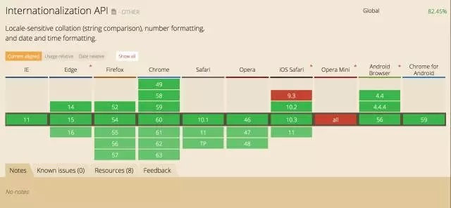

# 国际化(I18N)

i18n（其来源是英文单词 internationalization的首末字符i和n，18为中间的字符数）是“国际化”的简称。在资讯领域，国际化(i18n)指让产品（出版物，软件，硬件等）无需做大的改变就能够适应不同的语言和地区的需要。对程序来说，在不修改内部代码的情况下，能根据不同语言及地区显示相应的界面。 在全球化的时代，国际化尤为重要，因为产品的潜在用户可能来自世界的各个角落。通常与i18n相关的还有L10n（“本地化”的简称）。

在一些软件中，我们常常可以看到I18N文件夹，里面存放的就是国际化的资源文件。
  

国际化包含的东西很多，对于前端，最常接触到的就是将可本地化的元素与源代码或内容分开，以便可以根据需要根据用户的国际偏好来加载或选择本地化的替代。但国际化的工作远不止这些，例如国际化CDN 部署，Unicode 编码都可以算作国际化的范畴。

## 国际化API

浏览器已经支持部分的API了，介绍几个重要的API

**Intl.Collator**

Intl.Collator 是用于语言敏感字符串比较的 collators构造函数。语法：

`new Intl.Collator([locales[, options]])
Intl.Collator.call(this[, locales[, options]])`

locales 是可选参数，locales 的参数必须遵从 BCP 47 规范，locales 标记必须是 "en-US" 和 "zh-Hans-CN 等，这个标记包含了语言、地区和国家。完整的列表可以查看[ IANA language subtag registry](https://www.iana.org/assignments/language-subtag-registry/language-subtag-registry)。options 也是可选参数，它包含了特定比较选项的对象。

eg：

`var co1 = new Intl.Collator(["de-DE-u-co-phonebk"]);  
var co2 = new Intl.Collator(["de-DE"]);  
var co3 = new Intl.Collator(["en-US"]);  
var arr = ["ä", "ad", "af", "a"];  
if (console && console.log) {  
    console.log(arr.sort(co1.compare));  // Returns a,ad,ä,af  
    console.log(arr.sort(co2.compare));  // Returns a,ä,ad,af  
    console.log(arr.sort(co3.compare));  // Returns a,ä,ad,af  
}`

**Intl.DateTimeFormat**

Intl.DateTimeFormat是根据语言来格式化日期和时间的类的构造器类。

`new Intl.DateTimeFormat([locales[, options]])
Intl.DateTimeFormat.call(this[, locales[, options]])`

Intl.DateTimeFormat是根据语言来格式化日期和时间的类的构造器类。可以使用 options 参数来自定义 日期时间格式化方法返回的字符串。

`var date = new Date(Date.UTC(2012, 11, 20, 3, 0, 0));
// 下面是假定的所在时区
// 洛杉矶(America/Los_Angeles for the US)
// 美式英语(US English) 使用  month-day-year 格式
console.log(new Intl.DateTimeFormat('en-US').format(date));
// → "12/19/2012"
// 英式英语(British English) 使用 day-month-year 格式
console.log(new Intl.DateTimeFormat('en-GB').format(date));
// → "20/12/2012"
// 韩国使用 year-month-day 格式
console.log(new Intl.DateTimeFormat('ko-KR').format(date));
// → "2012. 12. 20."
//大部分阿拉伯国家使用阿拉伯字母(real Arabic digits)
console.log(new Intl.DateTimeFormat('ar-EG').format(date));
// → "٢٠‏/١٢‏/٢٠١٢"
//在日本，应用可能想要使用日本日历,
//2012 是平成24年（平成是是日本天皇明仁的年号,由1989年1月8日起开始计算直至现在）
console.log(new Intl.DateTimeFormat('ja-JP-u-ca-japanese').format(date));
// → "平成24/12/20"
//当请求一个语言可能不支持，如巴厘(ban)，若有备用的语言印尼语(id)，
//那么将使用印尼语(id)
console.log(new Intl.DateTimeFormat(['ban', 'id']).format(date));
// → "20/12/2012"`

**Intl.NumberFormat**

Intl.NumberFormat是对语言敏感的格式化数字类的构造器类。

`new Intl.NumberFormat([locales[, options]])
Intl.NumberFormat.call(this[, locales[, options]])`

eg:

`var number = 123456.789;
// 德语使用逗号作为小数点,使用.作为千位分隔符
console.log(new Intl.NumberFormat('de-DE').format(number));
// → 123.456,789
// 大多数阿拉伯语国家使用阿拉伯语数字
console.log(new Intl.NumberFormat('ar-EG').format(number));
// → ١٢٣٤٥٦٫٧٨٩
// India uses thousands/lakh/crore separators
console.log(new Intl.NumberFormat('en-IN').format(number));
// → 1,23,456.789
// 通过编号系统中的nu扩展键请求, 例如中文十进制数字
console.log(new Intl.NumberFormat('zh-Hans-CN-u-nu-hanidec').format(number));
// → 一二三,四五六.七八九
//当请求的语言不被支持,例如巴里,包含一个回滚语言印尼,这时候就会使用印尼语
console.log(new Intl.NumberFormat(['ban', 'id']).format(number));
// → 123.456,789`

###浏览器支持

[ECMAScript Internationalization API Specification](http://ecma-international.org/ecma-402/1.0/)

https://developer.mozilla.org/en-US/docs/Web/JavaScript/Reference/Global_Objects/Intl

### 生产环境中的应用

在生产环境中我们一般会引用第三方库，不同的技术方案引入的库也会不同。以下是几个主流的库／框架的解决方案：

vue + vue-i18n

angular + angular-translate

react + react-intl

jquery + jquery.i18n.property

###vue方案

http://kazupon.github.io/vue-i18n/en/started.html

